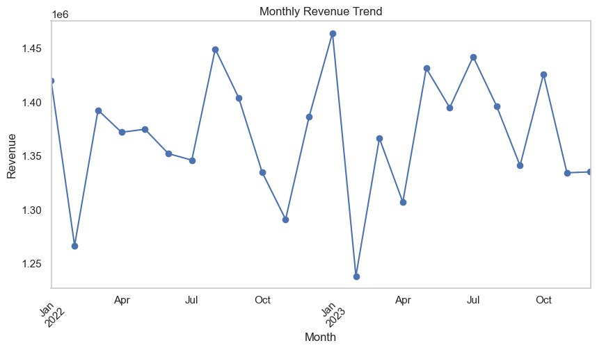
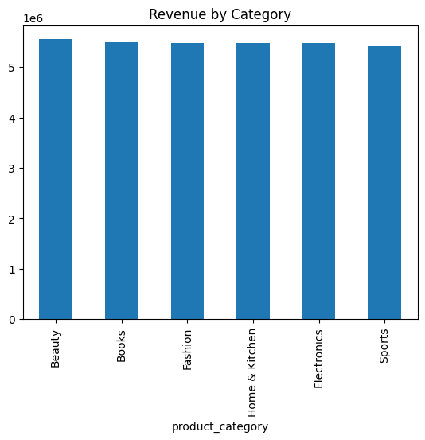
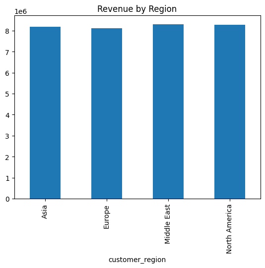
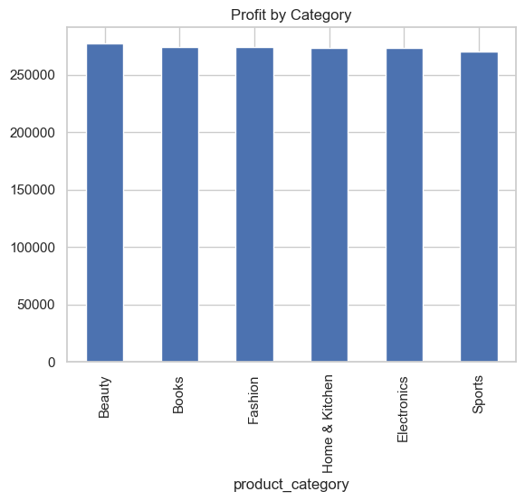
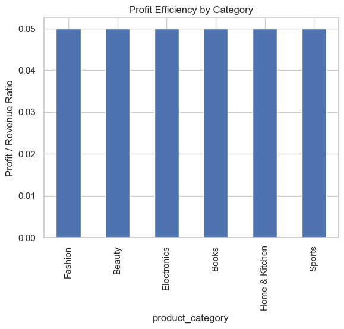

# 📊 Sales Data Analysis Project

## 📌 Overview
This project focuses on analyzing a retail sales dataset to uncover key business insights related to revenue trends, product performance, regional distribution, and profitability. This dataset is based on the sales made in "Amazon".

The goal is to transform raw data into meaningful insights using Python and data analysis techniques.

---

## 🛠️ Tools & Technologies
- Python
- Pandas
- Matplotlib
- Seaborn
- Jupyter Notebook

---

## 📂 Project Structure
sales-analysis/
│
├── data/
│ └── sales.csv
├── notebook/
│ └── analysis.ipynb
├── images/
├── README.md

---

## 🔍 Key Analysis Performed
- Data cleaning and preprocessing  
- Revenue trend analysis (monthly)  
- Product category performance analysis  
- Regional sales distribution  
- Profit analysis by category  
- Profit efficiency (profit-to-revenue ratio)  

---

## 📈 Key Insights

### 🔹 Revenue Trends
Revenue shows short-term fluctuations with no consistent long-term growth pattern, indicating variability in monthly performance.

### 🔹 Significant Revenue Drop
A notable decline (~15.4%) is observed between January and February of 2023, showing one of the sharpest short-term drops in the dataset.

### 🔹 Product Category Performance
Revenue is evenly distributed across all product categories, and no single category is dominating the market.

### 🔹 Regional Distribution
Sales are relatively uniform across all regions, suggesting no strong geographic dependency.

### 🔹 Profit Distribution
Profit remains consistent across categories, indicating balanced contribution from all product segments.

### 🔹 Profit Efficiency
Profit-to-revenue ratio (~5%) is consistent across all categories, suggesting a standardized pricing or cost structure.

---

## 📊 Sample Visualizations
### Monthly Revenue Trend

### Revenue by Category

### Revenue by Region

### Profit by Category

### Profit Efficiency

---

## 🚀 Future Improvements
- Add machine learning models for sales prediction  
- Perform customer segmentation  
- Analyze impact of discounts on profit  
- Build an interactive dashboard (Power BI / Streamlit)  

---

## 👤 Author
**Nabajit Pritam**  
- GitHub: https://github.com/nabajitpritam  
- LinkedIn: www.linkedin.com/in/nabajit-pritam-026308334  

---